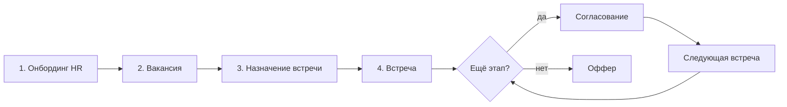

# PRDT-01-01-01-conveyor - Идея Конвейер

**ID:** `PRDT-01-01-01-conveyor` · Детальная проработка идеи «Конвейер».

> Родитель: [PRDT-01-01-00-0-ideas - Продуктовые идеи](./PRDT-01-01-00-0-ideas.md)  
> Раздел: [PRDT-01-00-00 - Идеи](../README.md)

---

## Суть

Система для повышения скорости найма: HR ведёт вакансию от публикации до оффера в одном конвейере — с мэтчем кандидатов, рекомендациями на каждом этапе и автоматизацией согласований.

---

## Компоненты

| Компонент | Где в конвейере |
|-----------|-----------------|
| **Автоматизация процессов** | шаги 2–N: вакансия, N этапов, слоты, календарь, напоминания, оффер |
| **Логирование** | каждый этап: встречи, записи, решения, согласования |
| **Сегментация** | шаг 3: ранжирование кандидатов, статистика, fit-score |

---

## Как выглядит конвейер

### 1. Онбординг HR

HR регистрируется, указывает информацию о компании и подключает свой **HeadHunter**. При регистрации кандидат и участники процесса **подтверждают согласие** на обработку данных и запись интервью.

### 2. Публикация вакансии

HR размещает вакансию:

- заполняет **функционал** роли;
- задаёт **желаемый профиль личности** через **свой опросник**;
- настраивает **процесс согласования** этапов и **участников** (HR, hiring manager, CEO и др.);
- задаёт **количество этапов интервью** (по умолчанию 2, настраивается N);
- указывает **свободные слоты** и **подключает календарь**.

### 3. Назначение встречи с кандидатом

HR **назначает встречу** с подходящим кандидатом:

- видит **статистику** и **наиболее подходящих** кандидатов (из **откликов и активного поиска** HH);
- получает **вопросы и рекомендации** для интервью;
- подтверждает **адженду** и **встречу**.

### 4–N. Цикл интервью (настраиваемое количество этапов)

Для каждого этапа:

**Проведение встречи:**

- напоминание и **ссылка для звонка** (интеграция с сервисом видеозвонков с **записью**);
- перед записью — **сообщение с подтверждением согласия** кандидата;
- **запись** звонка (серверы в **Казахстане**);
- **анализ и рекомендации** после встречи;
- **решение** о переходе на следующий этап.

**Согласование следующего этапа** (если этап не последний):

- вопросы и рекомендации для следующего интервью;
- подтверждение адженды и встречи — **HR и другие участники** процесса согласования.

### Финал. Формирование оффера

- **рекомендации по офферу**;
- подтверждение и отправка оффера.

---

## Brainstorm

### Проблема

HR тратит время на ручную координацию: поиск кандидатов в HH, переписка, слоты, напоминания, фиксация итогов интервью. Нет единого места, где виден fit кандидата, рекомендации по вопросам и история решений по воронке.

### Гипотеза

Если связать HH + календарь + мэтч + AI-рекомендации в один конвейер, HR быстрее доводит релевантных кандидатов до оффера и реже теряет сильных на этапе согласований.

### Целевая аудитория

- **Пользователь:** HR / рекрутер в компании со средним и выше наймом
- **Покупатель:** HRD, CEO малого и среднего бизнеса

### Сценарии использования

| # | Актор | Действие | Результат |
|---|-------|----------|-----------|
| 1 | HR | Регистрация + HH | Компания и источник кандидатов подключены |
| 2 | HR | Создание вакансии | Вакансия опубликована, воронка и слоты заданы |
| 3 | HR | Выбор кандидата из топа | Встреча назначена с аджендой |
| 4–N | HR + кандидат + участники | Интервью с записью (N этапов) | Решение зафиксировано, следующий этап или оффер |
| 7 | HR | Оффер | Кандидат получает предложение |

### Метрики успеха

- Time-to-first-interview (от публикации до первой встречи)
- Time-to-offer
- Conversion rate по этапам воронки
- Доля кандидатов из топ-N мэтча, дошедших до оффера

### Зависимости и связи

- **Daily.co** — видео и запись: [PRDT-01-01-02-daily - Решение по Daily.co](./PRDT-01-01-02-daily.md)
- **Мэтч** — ранжирование кандидатов на шаге 3 (профиль личности + профиль позиции)
- **Хаб экспертов** — пул релевантных профилей как источник кандидатов
- **HIPO** — предиктивная аналитика для оценки потенциала на позицию руководителя

### Решения

| Вопрос | Решение |
|--------|---------|
| Этапы интервью | По умолчанию **2**, настраивается **N** этапов на вакансию |
| Участники согласования | **HR + другие** (hiring manager, CEO и др.) |
| Видеозвонок и запись | **Daily.co** — см. [PRDT-01-01-02-daily](./PRDT-01-01-02-daily.md) |
| Данные из HH | **Отклики + активный поиск** |
| Профиль личности | **Свой опросник** |
| Запись интервью | Серверы в **Казахстане**; согласие при **регистрации** и **перед каждой записью** |

### Открытые вопросы

- Структура и содержание «своего опросника» профиля личности

### Следующие шаги

1. ~~Click-through прототип шага 1~~ → [conveyor-step-1](../../concepts/conveyor-step-1/prototype/index.html)
2. **Technical spike Daily → KZ S3** — см. [PRDT-01-01-02-daily](./PRDT-01-01-02-daily.md)
3. ~~Click-through прототип шага 2 (вакансия)~~ → [conveyor-step-2](../../concepts/conveyor-step-2/prototype/index.html) · **единый прототип шагов 1–3** → [conveyor](../../concepts/conveyor/prototype/index.html) · шаг 4 (интервью) — TBD
4. Описать модель данных: компания, вакансия, кандидат, этап, встреча, оффер
5. Согласовать интеграцию HH (API / OAuth)
6. ~~Проработать экран «топ кандидатов + рекомендации к интервью»~~ → шаг 3 в [едином прототипе](../../concepts/conveyor/prototype/index.html)
