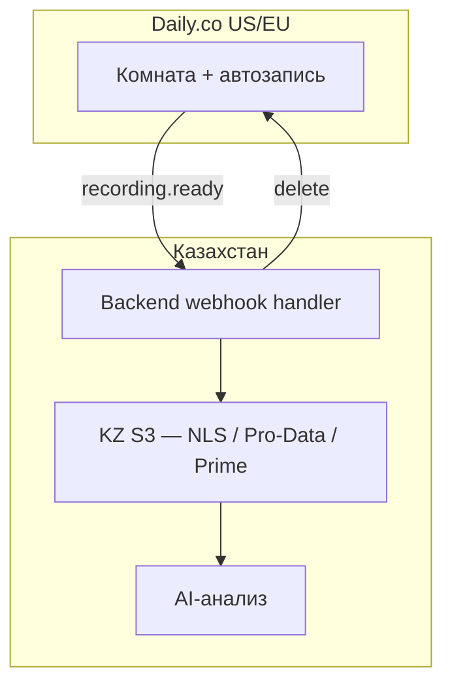

# PRDT-01-01-02-daily - Решение по Daily.co

**ID:** `PRDT-01-01-02-daily` · Выбор видеосервиса для конвейера найма.

> Связано: [PRDT-01-01-01-conveyor - Идея Конвейер](./PRDT-01-01-01-conveyor.md)  
> Раздел: [PRDT-01-00-00 - Идеи](../README.md)

---

## Решение

**Предварительно ориентируемся на Daily.co** как основной видеосервис для конвейера.

| Роль | Сервис |
|------|--------|
| **MVP / Primary** | Daily.co |
| **Enterprise tier (v2)** | Zoom Server-to-Server OAuth |
| **Plan B (compliance hard)** | Jitsi self-hosted в KZ |

---

## Почему Daily.co

| Критерий | Daily.co | Zoom | Telemost |
|----------|----------|------|----------|
| API для встраивания в продукт | ✅ | ✅ | ⚠️ только ссылки |
| Автозапись программно | ✅ | ✅ | ❌ локально |
| Скорость готовности записи | ✅ минуты | ⚠️ часы | ❌ |
| Масштаб без seat-ов | ✅ pay-per-minute | ⚠️ лицензии | — |
| Embedded UX в конвейере | ✅ | ⚠️ внешний клиент | ⚠️ |

**Zoom** — сильная альтернатива, если платформа сама организует встречи (S2S OAuth + `auto_recording: cloud`), но дороже в масштабе и медленнее pipeline записи.

**Telemost** — не подходит как primary: запись не в облаке продукта, слабый API для pipeline.

---

## Архитектура

Daily.co **не разворачивается в Казахстане** — это SaaS (US/EU). В KZ разворачивается **pipeline вокруг Daily**.

```
HR назначает встречу в конвейере
    ↓
Backend → Daily API (создать комнату, enable_recording)
    ↓
Платформа шлёт invite (email/SMS) + согласие на запись
    ↓
Встреча на Daily (видеопоток временно US/EU)
    ↓
Webhook: recording ready
    ↓
Backend (KZ VPS) → скачать → KZ S3 → удалить из Daily
    ↓
Транскрипт + AI-анализ + рекомендации HR
```



---

## Что где живёт

| Компонент | Локация | Постоянно? |
|-----------|---------|------------|
| Видеопоток во время звонка | Daily (US/EU) | Нет — только live |
| Временная запись | Daily Cloud | Нет — минуты, потом удаляем |
| Постоянное хранение | **KZ S3** | ✅ |
| Backend, транскрипт, AI | **KZ VPS** | ✅ |

**Согласие:** при регистрации на сервисе + сообщение перед каждой записью.

---

## KZ Object Storage (провайдеры)

- [NLS Kazakhstan](https://cloud.nls.kz/object-storage/)
- [Pro-Data](https://www.pro-data.tech/object-storage-kz)
- [Prime Cloud](https://docs.primecloud.kz/storage/s3/)

---

## Plan B

| Сценарий | Решение |
|----------|---------|
| Enterprise-клиент требует Zoom | Zoom S2S OAuth + тот же KZ S3 pipeline |
| Юрист: медиапоток не должен покидать KZ | Jitsi + Jibri на VPS в KZ |

---

## Следующий шаг

**Technical spike:** одна тестовая встреча Daily → webhook → KZ S3 → удаление из Daily.

**Критерий успеха:** запись в KZ bucket < 30 мин после звонка.

---

## Открытые вопросы

- Выбор KZ S3-провайдера (NLS vs Pro-Data vs Prime)
- STT для транскрипта (Whisper / Yandex SpeechKit / другой)
- SLA на время доставки записи в конвейер
